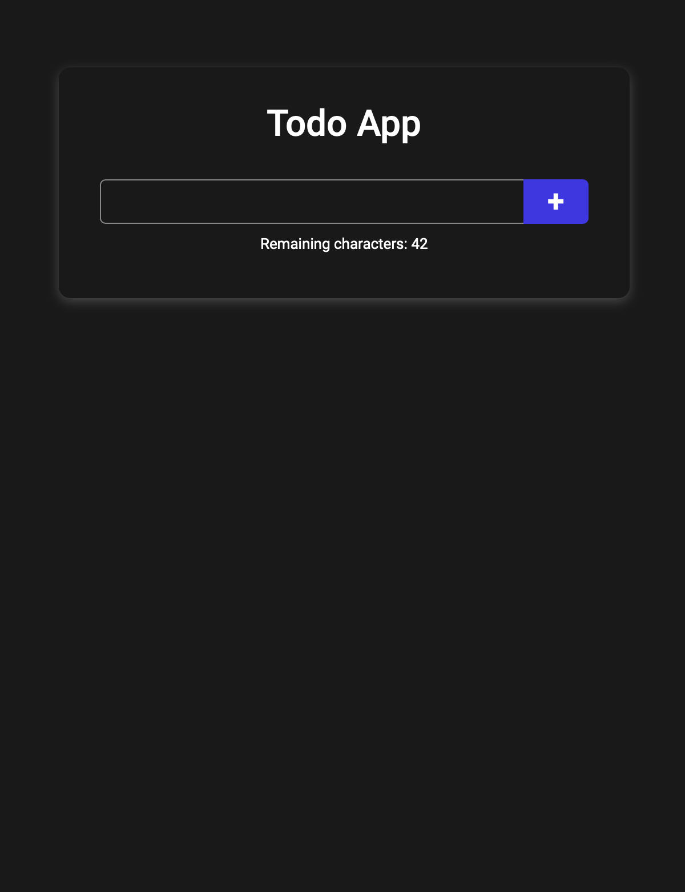
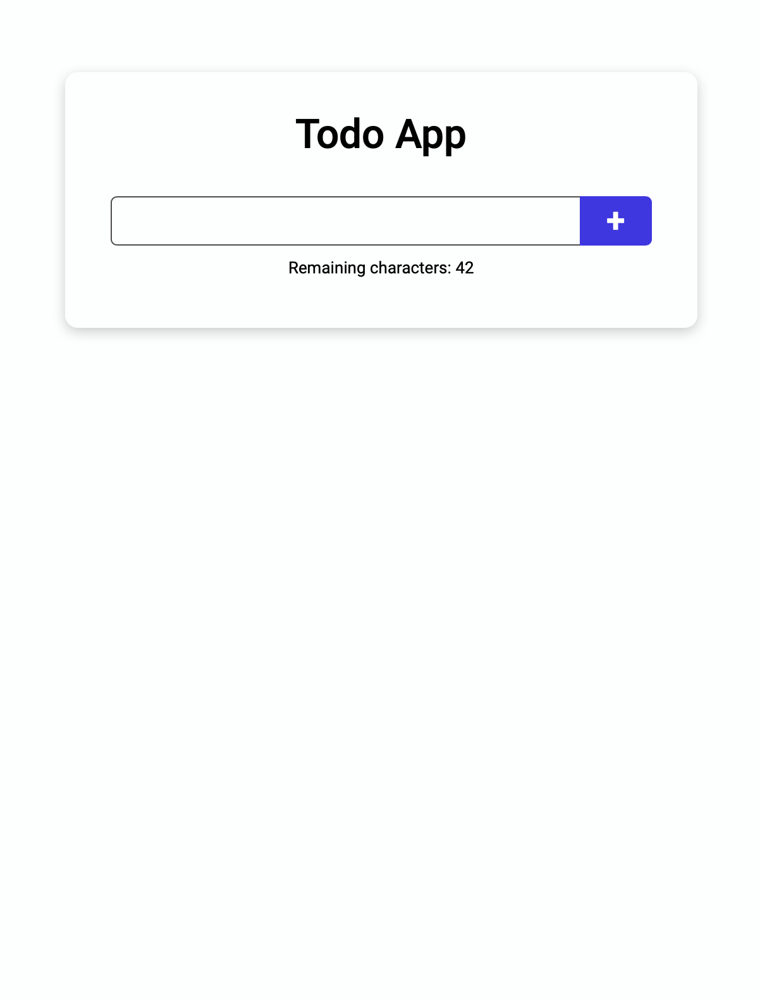
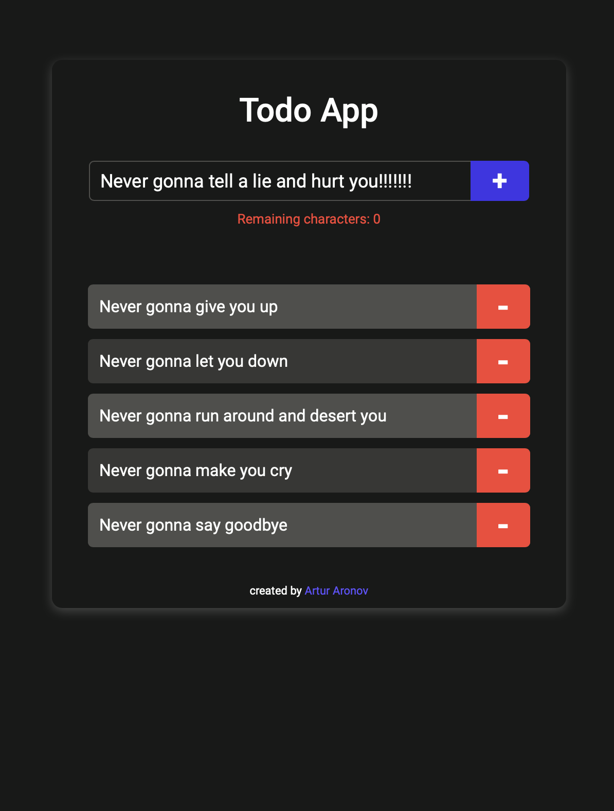
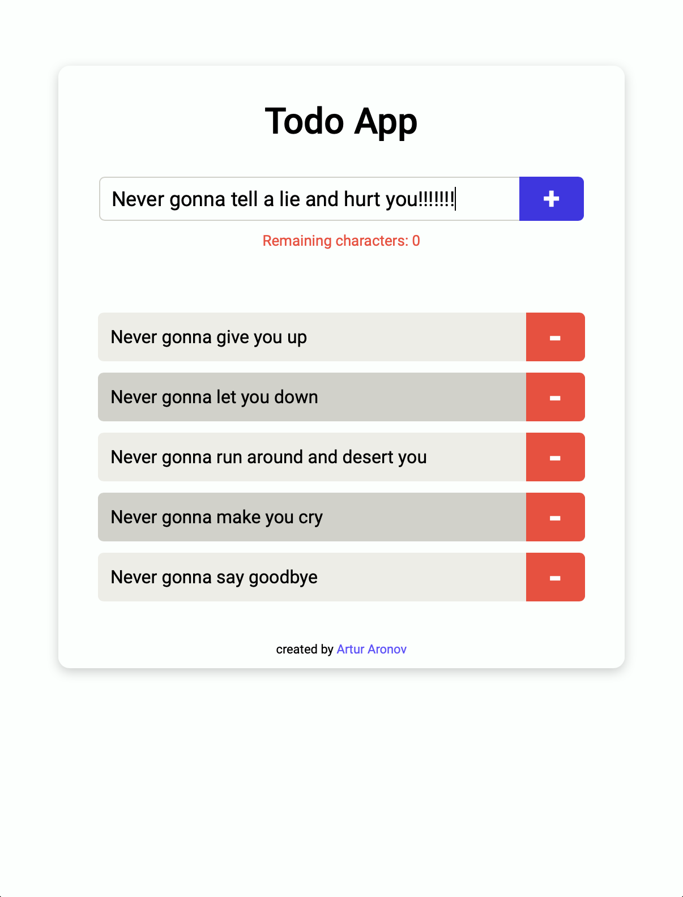
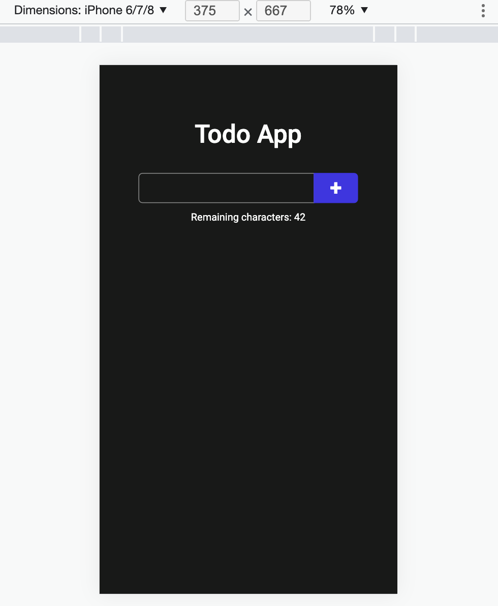
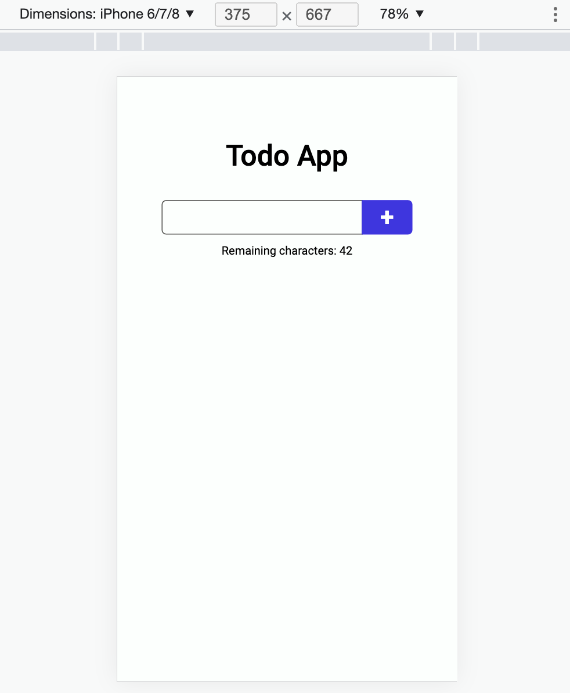

# React Todo App

## Live Site
https://todo-arturaronov.vercel.app/

## Table of Content
1. [Stack](#stack)
2. [Snapshots](#snapshots)
3. [Useful Links](#useful-links)
4. [Features](#features)
5. [Functions Explanations](#functions-explanations)
	5.1 [Character counting function](#character-counting-function)
	5.2 [New todo item addition function](#new-todo-item-addition-function)
	5.3 [Todo list creator function](#todo-list-creator-function)

### Stack
- React
- Vanilla CSS


### Snapshots
<p align='center'>
	
	
</center>
<p align='center'>
	
	
</p>
<p align='center'>
	
	
</p>

### Useful Links
A shortlist of resources that I found useful and kept returning to when working on the project.
[Box Shadow Effect - CSS Tricks](https://css-tricks.com/almanac/properties/b/box-shadow/)
[:nth-child - CSS Tricks](https://css-tricks.com/almanac/selectors/n/nth-child/)
[CSS Custom Properties/Variables - MDN Web Docs](https://developer.mozilla.org/en-US/docs/Web/CSS/Using_CSS_custom_properties)
[CSS prefers-color-theme for Dark/Light Mode - MDN Web Docs](https://developer.mozilla.org/en-US/docs/Web/CSS/@media/prefers-color-scheme)
[Dark Mode using prefers-colors-scheme rule and CSS variables - Juhana Jauhiainen](https://juhanajauhiainen.com/posts/dark-mode-using-prefers-color-scheme)


### Features
- Word count
- Alternating covers
- Changing color schemes
- Mobile/desktop versions

### Functions explanations
#### Character counting function
This function counts characters entered into the input field, to ensure that no more than 42 characters get entered. It will update the count regardless if one character is entered/deleted at a time or blocks of characters are entered/deleted at a time (important when users cut/paste text in the input field).

- First statement verifies that input is smaller/equal to 42. If true, the input value gets updated into ``setInputTxt``. Should the input length be larger that 42, then any additional characters will be ignored.

  ```
  if(inputLength<=42){
    setInputTxt(event.target.value)
  };
  ```

- Given statement will verify if text input increases, meaning characters get added into input form, meaning the remaining character count goes down.
  ```
  if(inputLength<=42&&textLength<inputLength){
    setCharacters(characters-difference);
  }
  ```

-  This statement will verify if entire text is highlighted and deleted at once, so that the character counts sets to default 42.
   ```
   else if(textLength>inputLength&&difference>1){
    setCharacters(characters+difference);
   }
   ```

- This statement will verify if entire text is highlighted and deleted at once, so that the character counts sets to default 42.
  ```
  else if(textLength>inputLength&&difference<1){
    setCharacters(characters-difference);
  }
  ```

- Last statement will verify if text input decreases, meaning characters get deleted, meaning the remaining character count goes up.
  ```
  else if(textLength>inputLength){
    setCharacters(characters+difference);
  }
  ```

-  As for the last step, the ternary conditional below checks if input length is larger/equal to 42 for the purpose to determine the class name for the word count. It is used when the count reaches 1 or 0 when the text turns red, otherwise the text is white/black (depending on the dark or light color scheme).
   ```
   inputLength>=42?setCountClass('characterCountWarning'):setCountClass('characterCountNormal');
   ```

```
const updateCharacters=function(event, setInputTxt, inputTxt, setCharacters, characters, setCountClass){
  const inputLength=event.target.value.length;
  const textLength=inputTxt.length;
  const difference=inputLength-textLength;

  if(inputLength<=42){
    setInputTxt(event.target.value)
  };

  if(inputLength<=42&&textLength<inputLength){
    setCharacters(characters-difference);
  } else if(textLength>inputLength&&difference>1){
    setCharacters(characters+difference);
  } else if(textLength>inputLength&&difference<1){
    setCharacters(characters-difference);
  }else if(textLength>inputLength){
    setCharacters(characters+difference);
  }

  inputLength>=42?setCountClass('characterCountWarning'):setCountClass('characterCountNormal');
};
```
____
The function below adds a new todo item into the ``todoArr`` every time the ``+`` button gets clicked.
One the todo item is added into the ``todoArr`` array, the ``setInputTxt`` gets set to empty string, ``setCharacters`` get set back to 42, ``setCountClass`` gets set back to ``'characterCountNorma'``.
As of last step ``return inputTxt.trim().length>0?pushintoArr():null`` will verify if the input is empty string. If input is an empty string - the input gets ignored, if input is not a empty string - it gets added into ``todoArr``.

#### New todo item addition function
```
const sendData=function(setTodoArr, todoArr, setInputTxt, inputTxt, setFooterVisibility, setCharacters, setCountClass){
  const pushIntoArr=function(){
      setTodoArr([...todoArr, {
      id: todoArr.length<1?0:todoArr[todoArr.length-1].id+1,
      todo: inputTxt,
      complete: false
    }])
    setFooterVisibility('');
  };
  setInputTxt('');
  setCharacters(42);
  setCountClass('characterCountNormal');
  return inputTxt.trim().length>0?pushIntoArr():null;
};
```
____
This item creates a list element of todo items. Within the list element, the paragraph element stores todo item. Next to the paragraph, a button gets created that allows to delete the list item. Every time the delete button gets clicked, it cretes new array ``newTodos`` that stores entirety of ``todoArr`` with the spread operator. Then from that array, an element gets spliced up by one element, starting from the current id of the element.

#### Todo List creator function
```
const createList=useCallback((e)=>
  (
  <li key={e.id}>
    <p className='listElement'>
      {e.todo}
    </p>
    <button className='clearButton' onClick={()=>{
      e.complete?e.complete=false:e.complete=true;
      const newTodos=[...todoArr];
      todoArr.splice(e.id, 1);
      setTodoArr(newTodos);
    }}>
      -
    </button>
  </li>
  ),[todoArr]);
```
